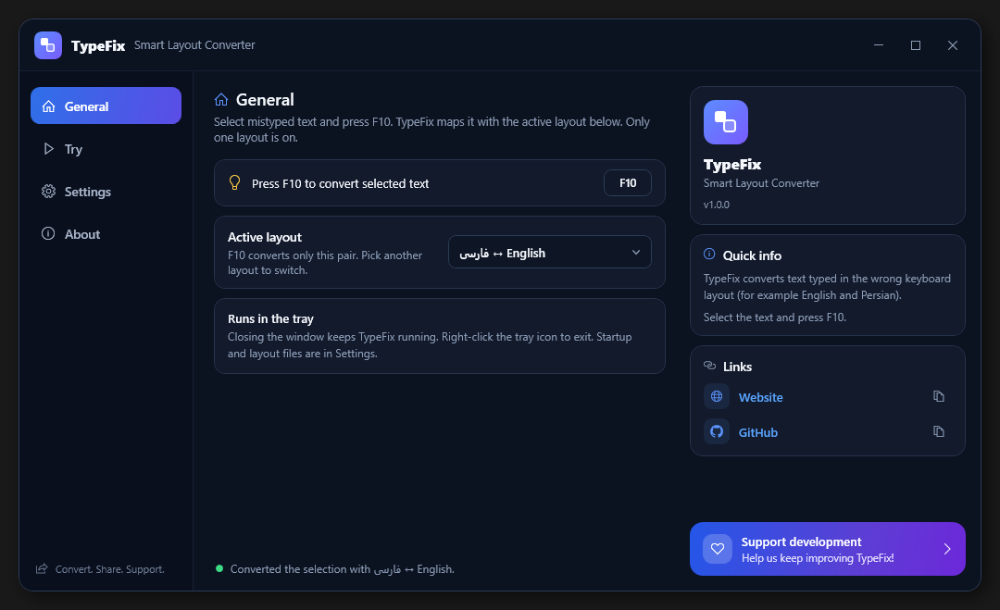

# TypeFix

Smart keyboard-layout converter for Windows.

Select text you typed in the wrong layout and press **F10**. TypeFix copies the selection, maps it to the other layout, and pastes it back. The default pair is **English (US QWERTY)** and **Persian (ISIRI 9147)**, including the Shift layer.

[English](#english) · [فارسی](#فارسی)



---

## English

### What it does

TypeFix is a small Windows desktop app. It stays in the system tray and listens for the global **F10** hotkey.

1. You select mistyped text in any app (the target window must stay focused).
2. You press **F10**.
3. TypeFix sends Ctrl+C, detects which layout the characters belong to, converts them, pastes the result with Ctrl+V, and restores your previous clipboard.

Example: Persian typed on an English layout, such as `slhm`, becomes `سلام`. The same key works in the other direction.

Closing the window hides TypeFix in the tray. It keeps running until you right-click the tray icon and choose **Exit**.

### Features

- Global **F10** hotkey (no modifier keys)
- Automatic direction detection between layout pairs
- English ↔ Persian (ISIRI 9147), including Shift characters such as `ژ`, `آ`, `ئ`, ZWNJ, and `؟`
- Arabic letter normalization (`ي` → `ی`, `ك` → `ک`) on the Persian layout, so scoring stays consistent
- Built-in pairs with English: فارسی، العربية، Français، Italiano، Español، Türkçe، 中文 (Zhuyin)، 한국어. Only the selected layout is active, and F10 uses that one
- Interface languages: English, فارسی, العربية, Français, Italiano, Español, Türkçe, 中文, 한국어
- Import more pairs as JSON
- Export every installed layout to a zip file
- Run at Windows sign-in (current user)
- System tray, with a balloon tip the first time the window is closed

### Requirements

| | |
|---|---|
| OS | Windows 10 or later (64-bit) |
| To build | [.NET 10 SDK](https://dotnet.microsoft.com/download/dotnet/10.0) |
| To run a framework-dependent build | [.NET 10 Desktop Runtime](https://dotnet.microsoft.com/download/dotnet/10.0) |
| IDE (optional) | Visual Studio 2022 or later, with the **.NET desktop development** workload |

This project targets `net10.0-windows` and uses WPF plus Windows Forms. It does not run on Linux or macOS.

Check the SDK:

```powershell
dotnet --version
```

You need a 10.x SDK.

### Build (compile)

From the repository root:

```powershell
dotnet restore
dotnet build -c Release
```

Or open `TypeFix.sln` in Visual Studio and build **Release**.

Output:

```text
bin\Release\net10.0-windows\TypeFix.exe
```

The Persian ↔ English layout is embedded in the app. A debug build may still copy `TypeFix.ico` next to the executable; a published single-file build does not need it.

### Run

Development:

```powershell
dotnet run -c Release
```

Or start `TypeFix.exe` from the build folder above. In Visual Studio, press **F5**.

After it starts:

1. Select text in another window.
2. Press **F10**.
3. If F10 is already taken, the status line reports that the hotkey could not be registered. Close the other app and restart TypeFix.

**Run at startup:** open the app, go to **General**, and turn on **Run TypeFix automatically on Windows startup**. This writes a value under `HKCU\Software\Microsoft\Windows\CurrentVersion\Run`.

### Publish (deploy)

Publish produces a folder you can zip and share. The `publish` folder is gitignored, so it is not committed. One publish is one CPU architecture: an x64 build does not also contain x86 or Arm64.

**Use the self-contained single-file build.** It compiles the app and bundles the .NET runtime and native libraries, so the target PC does not need a separate .NET install. That is the complete package.

The usual one is **64-bit**:

```powershell
dotnet publish -p:PublishProfile=win-x64
```

Output: `publish\win-x64\`

#### Self-contained (complete)

Profiles live in `Properties/PublishProfiles/`. Each one is Release, self-contained, single-file, and compressed.

| Profile | Command | Output | Use it for |
|---|---|---|---|
| `win-x64` | `dotnet publish -p:PublishProfile=win-x64` | `publish\win-x64\` | 64-bit Windows. This is the build to share. |
| `win-x86` | `dotnet publish -p:PublishProfile=win-x86` | `publish\win-x86\` | 32-bit Windows only. |
| `win-arm64` | `dotnet publish -p:PublishProfile=win-arm64` | `publish\win-arm64\` | Windows on ARM (native). |

One command for all three complete packages:

```powershell
foreach ($p in 'win-x64','win-x86','win-arm64') { dotnet publish -p:PublishProfile=$p; if ($LASTEXITCODE -ne 0) { break } }
```

`win-x86` also runs on 64-bit Windows, but it is the 32-bit app (slower, and limited to about 2 GB of memory). Prefer `win-x64` unless the PC is actually 32-bit. Windows 11 on ARM can emulate `win-x64`; ship `win-arm64` when you want the native build for those PCs.

#### Framework-dependent (smaller)

These folders are smaller because they leave the runtime out. The target PC must have the [.NET 10 Desktop Runtime](https://dotnet.microsoft.com/download/dotnet/10.0) of the **same** architecture.

```powershell
foreach ($r in 'win-x64','win-x86','win-arm64') { dotnet publish .\TypeFix.csproj -c Release -r $r --self-contained false -o ".\publish\framework-dependent\$r"; if ($LASTEXITCODE -ne 0) { break } }
```

For a self-contained publish, ship `TypeFix.exe` by itself. The default layout is inside the executable. Layouts a person imports are saved under `%AppData%\TypeFix\layouts`, not next to the exe. A framework-dependent build is still a folder, because it leaves the runtime out.

### Installer

Build a separate setup program for each architecture (self-contained, so the target PC does not need a separate .NET install). This requires [Inno Setup 6](https://jrsoftware.org/isdl.php).

```powershell
.\installer\build-installer.ps1
```

Output:

| File | Installs on |
|---|---|
| `installer\output\TypeFix-1.0.0-Setup-x64.exe` | 64-bit Windows |
| `installer\output\TypeFix-1.0.0-Setup-x86.exe` | 32-bit Windows (also runs on 64-bit Windows as a 32-bit app) |
| `installer\output\TypeFix-1.0.0-Setup-arm64.exe` | Windows on ARM |

Running that setup installs TypeFix for the current user in `%LOCALAPPDATA%\Programs\TypeFix`, adds a Start menu shortcut, and registers an uninstall entry in **Settings → Apps**. The setup wizard offers the same languages as the app: English, فارسی, العربية, Français, Italiano, Español, Türkçe, 中文, and 한국어. On the last page, **Create a desktop shortcut** and **Launch TypeFix** are both checked by default. A silent install does both unless you pass `/NODESKTOPICON` or `/NOLAUNCH`.

To install for yourself without the setup program, copy the publish folder anywhere (for example `%LOCALAPPDATA%\TypeFix`) and run `TypeFix.exe`. Enable startup from **General** after you place the exe in its final folder, so Windows launches that path.

### How to use

| Action | Result |
|---|---|
| Select text, press F10 | Convert the selection and paste it back |
| Close the window | Hide to the tray; conversion still works |
| Left-click the tray icon | Show the window |
| Tray menu → Exit | Quit |
| General or Settings → choose a layout | F10 uses that pair. Only one layout is on |
| Import | Add a `.json` layout file, or a zip of them |
| Export all | Save every installed layout to a zip file |

Overlapping F10 presses are ignored while a conversion is in progress. If the text does not match a configured layout, it is left unchanged.

### Layout configuration

Each language pair is one JSON file, in the same shape as the built-in Persian ↔ English layout. Put a clear `Name` on it, such as `Arabic ↔ English`. Import that file from General or Settings. Only the selected file is used.

Each pair maps two layouts by **key position**: the character at index `n` in layout 1 is the same physical key as index `n` in layout 2.

```json
{
  "Id": "en-fa",
  "Name": "Persian ↔ English",
  "LayoutPairs": [
    {
      "Name": "English-Persian",
      "Id": "en-fa",
      "Layout1Name": "English",
      "Layout2Name": "Persian",
      "Layout1Chars": "qwertyuiop[]asdfghjkl;'zxcvbnm,./",
      "Layout2Chars": "ضصثقفغعهخحجچشسیبلاتنمکگظطزرذدئو./",
      "Layout1ShiftChars": "QWERTYUIOP{}ASDFGHJKL:\"ZXCVBNM<>?",
      "Layout2ShiftChars": "..."
    }
  ]
}
```

Rules:

- `Layout1Chars` and `Layout2Chars` must be the same length. A file with unequal lengths is rejected.
- Shift strings are optional. If you set them, each must be the same length as its base string.
- Characters that appear in both layouts (for example `.` and `/`) are not used to guess direction.
- Import the file in the app. It becomes the active layout immediately.
- Export all writes every installed layout, including the built-in pair, into one zip.

The built-in pair is Persian ↔ English (ISIRI 9147), including the Shift layer. It stays in the app and cannot be removed.

### Add a language for switching

One JSON file is one switch pair, such as Chinese ↔ English or Arabic ↔ English. `Name` is the label in the list. Only one file can be on. F10 converts with that pair and does not cycle through the others.

TypeFix maps one character per physical key. The character at index `n` in `Layout1Chars` is the same key as index `n` in `Layout2Chars`, so the two strings must be the same length. Shared characters such as `.` and `/` are not used to guess direction. Shift strings are optional. If you add them, each must be the same length as its own base string.

Use the same key order as the built-in file:

```text
qwertyuiop[]asdfghjkl;'zxcvbnm,./
```

That is the US QWERTY letter block, left to right, row by row.

#### Steps

1. Click **Export all** and open the Persian file, or copy the example below.
2. Set `Id` and `Name`. `Name` is what the app shows, for example `Chinese ↔ English`.
3. Put the first layout in `Layout1Chars` and the other layout in `Layout2Chars`, one character per key, in the order above.
4. Save the file as `.json`.
5. In **General** or **Settings**, click **Import** and choose that file. It becomes the active layout.
6. Select text and press F10. To switch pairs, select another row in the list. Only the selected row is used.

**Export all** writes every installed layout, including the built-in pair, into one zip you can share.

#### Chinese ↔ English

This sample is only four keys, so you can see the alignment. It is not a full Chinese keyboard. A Pinyin input method is not a key-by-key layout, so it does not belong in this file. If each key on your layout types one character, list that character on the matching key.

If `q` should become `你`, `w` → `好`, `e` → `世`, and `r` → `界`:

```json
{
  "Id": "en-zh",
  "Name": "Chinese ↔ English",
  "LayoutPairs": [
    {
      "Id": "en-zh",
      "Name": "English-Chinese",
      "Layout1Name": "English",
      "Layout2Name": "Chinese",
      "Layout1Chars": "qwer",
      "Layout2Chars": "你好世界"
    }
  ]
}
```

`qwer` and `你好世界` are both length 4. Extend both strings together until they cover the keys you care about. Arabic, French, Russian, and any other character-per-key layout use these same steps. The **About** page in the app repeats this guide and can copy a full-length starter whose `Layout2Chars` still matches English, so F10 changes nothing until you replace those characters.

### Project layout

```text
TypeFix.sln
TypeFix.csproj
App.xaml / App.xaml.cs          application entry
MainWindow.xaml / .xaml.cs      window, tray, hotkey, startup
LanguageEngine.cs               layout scoring and conversion
LayoutCatalog.cs                built-in layout plus imported files
LayoutManagerControl.xaml       pick, import, and export layouts
Models/LayoutConfig.cs          JSON root
Models/LayoutPair.cs            one layout pair
TypeFixLayouts.json             built-in Persian ↔ English layout, embedded in the app
TypeFix.ico                   window and tray icon
```

### Before you share a build

The Links section shows Website and GitHub labels. Website opens `https://typefix.ir`. GitHub opens `https://github.com/sa2ncom/TypeFix`. The Support development card opens `https://typefix.ir/donate`.

### Troubleshooting

| Symptom | What to check |
|---|---|
| F10 does nothing | Another program owns F10. The status line shows a registration error. |
| Text is not replaced | The target window lost focus, or the selection did not match a layout pair. |
| Import fails | JSON syntax, or a pair whose character strings differ in length. |
| App does not start | For a framework-dependent build, install the .NET 10 Desktop Runtime. |

### License

TypeFix is released under the [MIT License](LICENSE).

The interface uses [Vazirmatn](https://github.com/rastikerdar/vazirmatn), copyright The Vazirmatn Project Authors, under the [SIL Open Font License 1.1](Fonts/OFL.txt). The font stays under that license. The MIT license covers the application code.

---

## فارسی

<div dir="rtl">

### این برنامه چه می‌کند

TypeFix یک برنامهٔ کوچک دسکتاپ برای ویندوز است. در system tray می‌ماند و میانبر سراسری **F10** را گوش می‌دهد.

۱. متنی را که با چیدمان اشتباه تایپ شده در هر برنامه‌ای انتخاب می‌کنید (پنجرهٔ مقصد باید فعال بماند).
۲. **F10** را می‌زنید.
۳. برنامه با Ctrl+C متن را برمی‌دارد، تشخیص می‌دهد کاراکترها متعلق به کدام چیدمان‌اند، تبدیل‌شان می‌کند، نتیجه را با Ctrl+V می‌چسباند، و کلیپ‌بورد قبلی را برمی‌گرداند.

مثال: اگر «سلام» را با چیدمان انگلیسی تایپ کرده باشید (`slhm`)، بعد از انتخاب و زدن F10 به «سلام» تبدیل می‌شود. همین کلید در جهت برعکس هم کار می‌کند.

بستن پنجره برنامه را در tray مخفی می‌کند. تا وقتی از منوی راست‌کلیک آیکون tray، **Exit** را نزنید، برنامه باز می‌ماند.

### قابلیت‌ها

- میانبر سراسری **F10** (بدون کلید همراه)
- تشخیص خودکار جهت تبدیل بین جفت‌چیدمان‌ها
- انگلیسی ↔ فارسی (استاندارد ISIRI 9147)، به‌همراه لایهٔ Shift مثل `ژ`، `آ`، `ئ`، نیم‌فاصله و `؟`
- یکسان‌سازی حروف عربی (`ي` به `ی` و `ك` به `ک`) فقط در چیدمان فارسی، تا تشخیص جهت به‌هم نریزد
- جفت‌های داخلی با English: فارسی، العربية، Français، Italiano، Español، Türkçe، 中文 (注音)، 한국어. فقط چیدمان انتخاب‌شده روشن است و F10 همان را به کار می‌برد
- زبان رابط: English، فارسی، العربية، Français، Italiano، Español، Türkçe، 中文، 한국어
- وارد کردن جفت‌های دیگر با فایل JSON
- خروجی گرفتن از همهٔ چیدمان‌های نصب‌شده در یک فایل zip
- اجرا هنگام ورود به ویندوز (کاربر جاری)
- system tray، با یک راهنمای کوتاه اولین باری که پنجره بسته می‌شود

### پیش‌نیازها

| | |
|---|---|
| سیستم‌عامل | ویندوز ۱۰ یا جدیدتر (۶۴بیتی) |
| برای ساخت | [SDK دات‌نت ۱۰](https://dotnet.microsoft.com/download/dotnet/10.0) |
| برای اجرای نسخهٔ وابسته به فریم‌ورک | [ران‌تایم دسکتاپ دات‌نت ۱۰](https://dotnet.microsoft.com/download/dotnet/10.0) |
| محیط توسعه (اختیاری) | ویژوال استودیو ۲۰۲۲ یا جدیدتر، با بار کاری **.NET desktop development** |

هدف پروژه `net10.0-windows` است و از WPF و Windows Forms استفاده می‌کند. روی لینوکس و مک اجرا نمی‌شود.

بررسی SDK:

</div>

```powershell
dotnet --version
```

<div dir="rtl">

باید نسخهٔ ۱۰ باشد.

### ساخت (کامپایل)

از ریشهٔ مخزن:

</div>

```powershell
dotnet restore
dotnet build -c Release
```

<div dir="rtl">

یا `TypeFix.sln` را در ویژوال استودیو باز کنید و پیکربندی **Release** را بسازید.

خروجی:

</div>

```text
bin\Release\net10.0-windows\TypeFix.exe
```

<div dir="rtl">

چیدمان فارسی ↔ انگلیسی داخل خود برنامه است. ساختِ توسعه ممکن است `TypeFix.ico` را کنار اجرایی کپی کند؛ انتشار تک‌فایل به آن نیاز ندارد.

### اجرا

هنگام توسعه:

</div>

```powershell
dotnet run -c Release
```

<div dir="rtl">

یا `TypeFix.exe` را از پوشهٔ ساخت بالا اجرا کنید. در ویژوال استودیو کلید **F5** را بزنید.

بعد از بالا آمدن برنامه:

۱. در پنجرهٔ دیگری متن را انتخاب کنید.
۲. **F10** را بزنید.
۳. اگر F10 از قبل گرفته شده باشد، نوار وضعیت می‌گوید میانبر ثبت نشده است. برنامهٔ دیگر را ببندید و TypeFix را دوباره اجرا کنید.

**اجرا هنگام روشن شدن ویندوز:** برنامه را باز کنید، به **General** بروید و گزینهٔ **Run TypeFix automatically on Windows startup** را روشن کنید. این کار یک مقدار در `HKCU\Software\Microsoft\Windows\CurrentVersion\Run` می‌نویسد.

### انتشار (استقرار)

دستور publish پوشه‌ای می‌سازد که می‌توانید فشرده کنید و به دیگران بدهید. پوشهٔ `publish` در git نادیده گرفته می‌شود و وارد مخزن نمی‌شود. هر انتشار فقط یک معماری پردازنده است: خروجی ۶۴بیتی، نسخهٔ ۳۲بیتی یا Arm64 را داخل خودش ندارد.

**نسخهٔ مستقل و تک‌فایل را بسازید.** این حالت خود برنامه را کامپایل می‌کند و ران‌تایم دات‌نت و کتابخانه‌های بومی را هم کنارش می‌گذارد، پس رایانهٔ مقصد به نصب جداگانهٔ دات‌نت نیاز ندارد. این همان بستهٔ کامل است.

نسخهٔ معمول **۶۴بیتی** است:

</div>

```powershell
dotnet publish -p:PublishProfile=win-x64
```

<div dir="rtl">

خروجی: `publish\win-x64\`

#### مستقل (کامل)

پروفایل‌ها در `Properties/PublishProfiles/` هستند. هر کدام Release، مستقل، تک‌فایل و فشرده‌شده است.

| پروفایل | دستور | خروجی | برای چه سیستمی |
|---|---|---|---|
| `win-x64` | `dotnet publish -p:PublishProfile=win-x64` | `publish\win-x64\` | ویندوز ۶۴بیتی. همین را به دیگران بدهید. |
| `win-x86` | `dotnet publish -p:PublishProfile=win-x86` | `publish\win-x86\` | فقط ویندوز ۳۲بیتی. |
| `win-arm64` | `dotnet publish -p:PublishProfile=win-arm64` | `publish\win-arm64\` | ویندوز روی پردازندهٔ ARM (بومی). |

یک دستور برای هر سه بستهٔ کامل:

</div>

```powershell
foreach ($p in 'win-x64','win-x86','win-arm64') { dotnet publish -p:PublishProfile=$p; if ($LASTEXITCODE -ne 0) { break } }
```

<div dir="rtl">

`win-x86` روی ویندوز ۶۴بیتی هم اجرا می‌شود، ولی برنامهٔ ۳۲بیتی است (کندتر، و حافظه‌اش حدود ۲ گیگابایت سقف دارد). مگر رایانه واقعاً ۳۲بیتی باشد، `win-x64` را انتخاب کنید. ویندوز ۱۱ روی ARM می‌تواند `win-x64` را شبیه‌سازی کند؛ اگر برای آن رایانه‌ها نسخهٔ بومی می‌خواهید، `win-arm64` را بسازید.

#### وابسته به فریم‌ورک (حجم کمتر)

این پوشه‌ها کوچک‌ترند چون ران‌تایم داخلشان نیست. رایانهٔ مقصد باید [ران‌تایم دسکتاپ دات‌نت ۱۰](https://dotnet.microsoft.com/download/dotnet/10.0) را با **همان** معماری نصب داشته باشد.

</div>

```powershell
foreach ($r in 'win-x64','win-x86','win-arm64') { dotnet publish .\TypeFix.csproj -c Release -r $r --self-contained false -o ".\publish\framework-dependent\$r"; if ($LASTEXITCODE -ne 0) { break } }
```

<div dir="rtl">

در انتشارِ خودکفا فقط `TypeFix.exe` را بفرستید. چیدمان پیش‌فرض داخل اجرایی است. چیدمان‌هایی که کاربر وارد می‌کند در `%AppData%\TypeFix\layouts` ذخیره می‌شوند، نه کنار فایل exe. نسخهٔ وابسته به فریم‌ورک همچنان یک پوشه است، چون ران‌تایم همراهش نیست.

### نصب‌کننده

برای هر معماری یک برنامهٔ نصب جدا بسازید (خودکفا، تا رایانهٔ مقصد به نصب جداگانهٔ دات‌نت نیاز نداشته باشد). برای ساخت، [Inno Setup 6](https://jrsoftware.org/isdl.php) لازم است.

```powershell
.\installer\build-installer.ps1
```

خروجی:

| فایل | نصب روی |
|---|---|
| `installer\output\TypeFix-1.0.0-Setup-x64.exe` | ویندوز ۶۴بیتی |
| `installer\output\TypeFix-1.0.0-Setup-x86.exe` | ویندوز ۳۲بیتی (روی ویندوز ۶۴بیتی هم به‌صورت برنامهٔ ۳۲بیتی اجرا می‌شود) |
| `installer\output\TypeFix-1.0.0-Setup-arm64.exe` | ویندوز روی پردازندهٔ ARM |

اجرای این فایل، TypeFix را برای کاربر جاری در `%LOCALAPPDATA%\Programs\TypeFix` نصب می‌کند، میانبر منوی استارت می‌سازد، و حذف برنامه را در **Settings → Apps** ثبت می‌کند. زبان‌های نصب همان زبان‌های برنامه است: English، فارسی، العربية، Français، Italiano، Español، Türkçe، 中文 و 한국어. در صفحهٔ پایانی، **ساخت میانبر روی دسکتاپ** و **اجرای TypeFix** هر دو به‌طور پیش‌فرض تیک خورده‌اند. نصب بی‌صدا هم هر دو را انجام می‌دهد، مگر اینکه `/NODESKTOPICON` یا `/NOLAUNCH` را بدهید.

برای نصب بدون برنامهٔ نصب، پوشهٔ انتشار را هر جا خواستید کپی کنید (مثلاً `%LOCALAPPDATA%\TypeFix`) و `TypeFix.exe` را اجرا کنید. گزینهٔ اجرا هنگام ورود را بعد از قرار دادن فایل در مسیر نهایی روشن کنید تا ویندوز همان مسیر را باز کند.

### روش استفاده

| کار | نتیجه |
|---|---|
| انتخاب متن و زدن F10 | تبدیل انتخاب و چسباندن نتیجه |
| بستن پنجره | رفتن به tray؛ تبدیل همچنان کار می‌کند |
| کلیک چپ روی آیکون tray | نمایش پنجره |
| منوی tray → Exit | خروج |
| عمومی یا تنظیمات → انتخاب چیدمان | F10 همان جفت را به کار می‌برد. فقط یکی روشن است |
| وارد کردن | افزودن یک فایل `.json` یا یک zip از آن‌ها |
| خروجی همه | ذخیرهٔ همهٔ چیدمان‌های نصب‌شده در یک zip |

اگر هنگام یک تبدیل دوباره F10 زده شود، فشار اضافه نادیده گرفته می‌شود. اگر متن با هیچ جفت‌چیدمانی جور نباشد، دست‌نخورده می‌ماند.

### پیکربندی چیدمان

هر جفت زبان یک فایل JSON است، با همان شکل چیدمان داخلی فارسی ↔ انگلیسی. روی آن یک `Name` روشن بگذارید، مثل `Arabic ↔ English`. فایل را از صفحهٔ عمومی یا تنظیمات وارد کنید. فقط فایل انتخاب‌شده استفاده می‌شود.

هر جفت، دو چیدمان را بر اساس **جای کلید** به هم وصل می‌کند: نویسهٔ اندیس `n` در چیدمان اول همان کلید فیزیکی اندیس `n` در چیدمان دوم است.

</div>

```json
{
  "Id": "en-fa",
  "Name": "Persian ↔ English",
  "LayoutPairs": [
    {
      "Name": "English-Persian",
      "Id": "en-fa",
      "Layout1Name": "English",
      "Layout2Name": "Persian",
      "Layout1Chars": "qwertyuiop[]asdfghjkl;'zxcvbnm,./",
      "Layout2Chars": "ضصثقفغعهخحجچشسیبلاتنمکگظطزرذدئو./",
      "Layout1ShiftChars": "QWERTYUIOP{}ASDFGHJKL:\"ZXCVBNM<>?",
      "Layout2ShiftChars": "..."
    }
  ]
}
```

<div dir="rtl">

قواعد:

- طول `Layout1Chars` و `Layout2Chars` باید برابر باشد. فایلی که طول‌هایش فرق کند رد می‌شود.
- رشته‌های Shift اختیاری‌اند. اگر بگذاریدشان، طول هر کدام باید با رشتهٔ پایهٔ خودش یکی باشد.
- نویسه‌های مشترک هر دو چیدمان (مثل `.` و `/`) برای حدس زدن جهت استفاده نمی‌شوند.
- فایل را در برنامه وارد کنید. همان لحظه چیدمان فعال می‌شود.
- خروجی همه، همهٔ چیدمان‌های نصب‌شده از جمله جفت داخلی را در یک zip می‌نویسد.

جفت داخلی فارسی ↔ انگلیسی (ISIRI 9147) است، از جمله لایهٔ Shift. داخل برنامه می‌ماند و حذف نمی‌شود.

### افزودن زبان برای سوییچ

هر فایل JSON یک جفت سوییچ است، مثل چینی ↔ انگلیسی یا عربی ↔ انگلیسی. `Name` نامی است که در لیست دیده می‌شود. فقط یک فایل می‌تواند روشن باشد. F10 با همان جفت تبدیل می‌کند و بین بقیه نمی‌چرخد.

TypeFix هر کلید فیزیکی را به یک نویسه وصل می‌کند. نویسهٔ اندیس `n` در `Layout1Chars` همان کلید اندیس `n` در `Layout2Chars` است، پس طول دو رشته باید برابر باشد. نویسه‌های مشترک مثل `.` و `/` برای حدس زدن جهت استفاده نمی‌شوند. رشته‌های Shift اختیاری‌اند. اگر بگذاریدشان، طول هر کدام باید با رشتهٔ پایهٔ خودش یکی باشد.

ترتیب کلیدها را مثل فایل داخلی نگه دارید:

```text
qwertyuiop[]asdfghjkl;'zxcvbnm,./
```

این بلوک حروف QWERTY آمریکایی است، از چپ به راست و ردیف به ردیف.

#### قدم‌ها

1. **خروجی همه** را بزنید و فایل فارسی را باز کنید، یا نمونهٔ زیر را کپی کنید.
2. `Id` و `Name` را بگذارید. `Name` همان چیزی است که برنامه نشان می‌دهد، مثلاً `Chinese ↔ English`.
3. چیدمان اول را در `Layout1Chars` و چیدمان دوم را در `Layout2Chars` بنویسید، هر کلید یک نویسه، با ترتیب بالا.
4. فایل را با پسوند `.json` ذخیره کنید.
5. در **عمومی** یا **تنظیمات**، **وارد کردن** را بزنید و همان فایل را انتخاب کنید. همان لحظه فعال می‌شود.
6. متن را انتخاب کنید و F10 را بزنید. برای عوض کردن جفت، ردیف دیگری را در لیست انتخاب کنید. فقط ردیف انتخاب‌شده استفاده می‌شود.

**خروجی همه** همهٔ چیدمان‌های نصب‌شده، از جمله جفت داخلی، را در یک zip می‌ریزد تا بتوانید بفرستید.

#### چینی ↔ انگلیسی

این نمونه فقط چهار کلید است تا ردیف شدن نویسه‌ها معلوم باشد. صفحه‌کلید کامل چینی نیست. ورودی پین‌یین چیدمان کلیدبه‌کلید نیست و داخل این فایل نمی‌آید. اگر روی چیدمان شما هر کلید یک نویسه می‌دهد، همان نویسه را روی کلید متناظر بنویسید.

اگر `q` باید `你` شود، `w` به `好`، `e` به `世` و `r` به `界`:

```json
{
  "Id": "en-zh",
  "Name": "Chinese ↔ English",
  "LayoutPairs": [
    {
      "Id": "en-zh",
      "Name": "English-Chinese",
      "Layout1Name": "English",
      "Layout2Name": "Chinese",
      "Layout1Chars": "qwer",
      "Layout2Chars": "你好世界"
    }
  ]
}
```

طول `qwer` و `你好世界` هر دو ۴ است. هر دو رشته را با هم ادامه دهید تا کلیدهایی که می‌خواهید پوشش داده شوند. عربی، فرانسه، روسی و هر چیدمان حرف‌به‌کلید دیگر با همین قدم‌ها ساخته می‌شوند. صفحهٔ **درباره** در برنامه همین راهنما را نشان می‌دهد و می‌تواند یک نمونهٔ کامل کپی کند که `Layout2Chars` آن هنوز انگلیسی است، تا وقتی نویسه‌ها را عوض نکرده‌اید F10 چیزی را تغییر ندهد.

### ساختار پروژه

</div>

```text
TypeFix.sln
TypeFix.csproj
App.xaml / App.xaml.cs          ورود برنامه
MainWindow.xaml / .xaml.cs      پنجره، tray، میانبر، اجرای خودکار
LanguageEngine.cs               امتیازدهی چیدمان و تبدیل
LayoutCatalog.cs                چیدمان داخلی و فایل‌های واردشده
LayoutManagerControl.xaml       انتخاب، وارد کردن و خروجی چیدمان‌ها
Models/LayoutConfig.cs          ریشهٔ JSON
Models/LayoutPair.cs            یک جفت چیدمان
TypeFixLayouts.json             چیدمان داخلی فارسی ↔ انگلیسی، داخل برنامه
TypeFix.ico                   آیکون پنجره و tray
```

<div dir="rtl">

### پیش از اشتراک‌گذاری یک نسخه

بخش Links فقط برچسب‌های Website و GitHub را نشان می‌دهد. Website نشانی `https://typefix.ir` را باز می‌کند و GitHub نشانی `https://github.com/sa2ncom/TypeFix` را. کارت Support development نشانی `https://typefix.ir/donate` را باز می‌کند.

### رفع اشکال

| نشانه | چه چیزی را بررسی کنید |
|---|---|
| F10 هیچ کاری نمی‌کند | برنامهٔ دیگری F10 را گرفته است. نوار وضعیت خطای ثبت میانبر را نشان می‌دهد. |
| متن عوض نمی‌شود | پنجرهٔ مقصد فوکوس را از دست داده، یا انتخاب با هیچ جفت‌چیدمانی جور نبوده است. |
| وارد کردن خطا می‌دهد | خطای نحوی JSON، یا جفتی که طول رشته‌های نویسه‌اش برابر نیست. |
| برنامه بالا نمی‌آید | برای نسخهٔ وابسته به فریم‌ورک، ران‌تایم دسکتاپ دات‌نت ۱۰ را نصب کنید. |

### لایسنس

TypeFix تحت [مجوز MIT](LICENSE) منتشر شده است.

رابط برنامه از فونت [Vazirmatn](https://github.com/rastikerdar/vazirmatn) استفاده می‌کند. حق نشر این فونت برای The Vazirmatn Project Authors است و تحت [SIL Open Font License 1.1](Fonts/OFL.txt) قرار دارد. خود فونت با همان مجوز می‌ماند. مجوز MIT فقط کد برنامه را پوشش می‌دهد.

</div>
